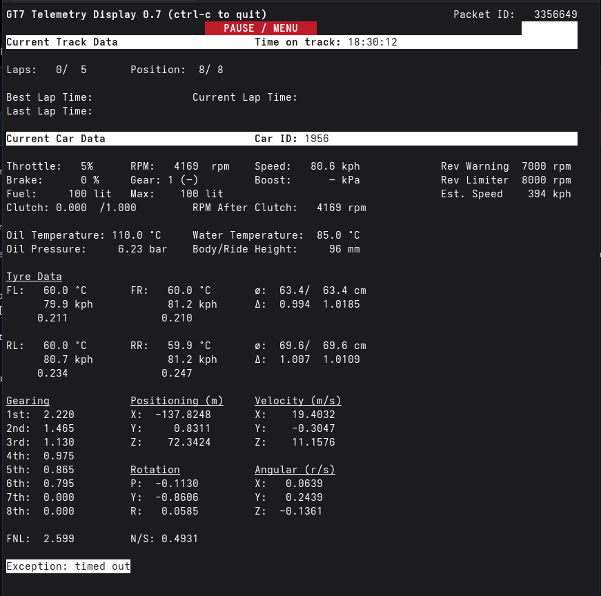

    
    Python script originally from https://github.com/Bornhall/gt7telemetry
    who take it from https://github.com/lmirel/mfc/blob/master/clients/gt7racedata.py
    I edited it to transform in what I need (the opening of the port 9999 for a second script)

(The Current Lap Time don't work, I didn't find the good offset value.)

🏎️ GT7 Telemetry Bridge & Dashboard 🏎️

This Python script intercepts the UDP telemetry stream from Gran Turismo 7 (PS4/PS5). 
It provides a comprehensive live dashboard in your terminal and functions as a data bridge, forwarding processed telemetry to external applications (like an AI agent or custom data logger) via a secondary UDP socket.
Key Features

    Live Terminal UI: A full-screen dashboard displaying speed, gear, RPM, tire temperatures, slip ratios, oil/water temps, and G-force data.

    Salsa20 Decryption: Automatically handles the decryption of the GT7 data stream using the required library.

    Session Intelligence: Intelligent status detection (In Race, Paused, Menu, or Replay) to filter data correctly.

    Nexus Bridge: Forwards structured JSON data to 127.0.0.1:9999, allowing other scripts to "subscribe" to the car's state without needing to handle decryption themselves.

    Automated Heartbeat: Manages the "Heartbeat" signal required by the PlayStation to keep the data stream active.

Requirements

To run this script, you need Python 3.x and the pycryptodome library, which provides the Salsa20 cipher used by Polyphony Digital to encrypt the packets.
Installation via Pip

Run the following command in your terminal:
    Bash
    
    pip install pycryptodome

(Note: The script imports Crypto.Cipher, which is provided by the pycryptodome package. Avoid installing the old pycrypto package as it is no longer maintained.)
How to Use

    Find your PlayStation IP: Go to your PS5/PS4 Network Settings and note the IP address.

    Run the script:
    Bash

    python3 gt7telemetry.py <your-playstation-ip>

    Start Driving: As soon as you enter a track, the terminal will populate with live data.

Data Forwarding (The Bridge)

The script is configured to send a simplified JSON packet to Port 9999 on your local machine. If you are developing another tool (like a dashboard,logger), simply listen on UDP 127.0.0.1:9999.
